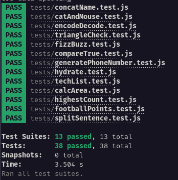

# Playground Functions - Projeto Trybe



## Projeto da Escola Trybe

Este projeto foi desenvolvido como parte da formação de Desenvolvedor Web na Trybe. O objetivo do projeto é praticar o uso de JavaScript e tratamento de strings.

## Tecnologia Utilizada


## Funcionalidades do Projeto

O projeto "Playground Functions" consiste em um conjunto de funções que realizam diversas operações de manipulação de strings. As principais funcionalidades do projeto incluem:

- **reverseString:** Inverte a ordem dos caracteres de uma string.
- **testPalindrome:** Verifica se uma string é um palíndromo (lê-se da mesma forma de trás para frente).
- **encode:** Realiza a substituição de caracteres de uma string conforme regras específicas.
- **decode:** Realiza a substituição de caracteres de uma string conforme regras específicas (inverso do encode).
- **techList:** Cria uma lista ordenada de tecnologias a partir de um array de strings.
- **generatePhoneNumber:** Gera um número de telefone formatado a partir de um array de dígitos.

## Como Usar

1. Clone o Projeto

```bash
git clone https://github.com/EversonDias/Project_Trybe_JavaScript_Playground_Functions.git PlaygroundFunctions
```

2. Entre na Pasta

```bash
cd PlaygroundFunctions
```

3. Instale as Dependências

```bash
npm install
```

4. Rode os Tests

```bash
npm test
```
